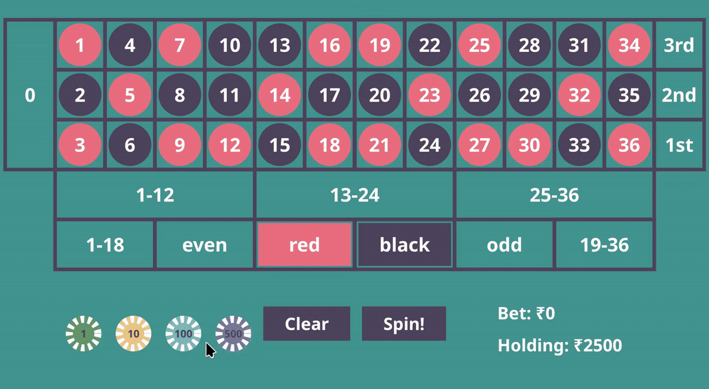

# Roulette

Roulette is a simple casino game widely played around the world.
This an attempt to make a online Roulette.

> 🚧 **CAUTION**
>  
> This project is experimental and was fun project.
> I am not interested to maintain it any more
> I had thought of making it collaborative, there are code related to it. But it is broken.

Feel free to fork. I love the UI. I almost made a 2d board game engine kind of thing for the canvas. 
You can learn from whats in canvas. 



## How to run

The script does use zellij. I may add other ways such as docker later. 
```bash
./meta/run_servers
```
